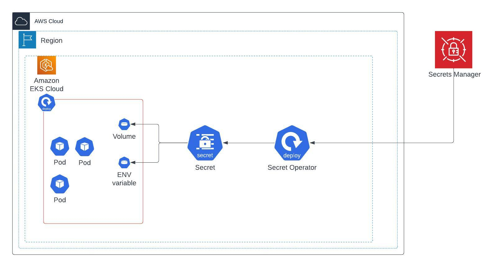

# Managing secrets on Kubernetes

Our client is currently utilizing Kubernetes on AWS (EKS + Terraform) and storing sensitive data, such as database passwords, in a configuration file that is saved alongside the code on Github. To ensure that the relevant secrets for the specific environment, such as staging or production, are loaded into the application pod, an ENV variable with the name of the environment is assigned.
We aim to assist our client in enhancing their approach to handling sensitive information.

## Solution Overview.

In Kubernetes, the fundamental principle is to securely store sensitive information, known as secrets, in external, highly secure, and fault-tolerant storage systems. This practice is crucial to safeguarding confidential data. To seamlessly integrate these secrets into Kubernetes applications, operators designed for this purpose operate within the cluster. These operators facilitate the synchronization of specified secrets from the external storage into Kubernetes' internal secrets vault.

Once securely stored within Kubernetes, these secrets can be conveniently injected into application pods. This injection can take various forms, including setting them as environment variables or mounting secret files directly into the pod's filesystem. This ensures that sensitive data, such as passwords, tokens, or encryption keys, remains protected and accessible only to authorized applications within the Kubernetes ecosystem.

## Requirements

**Data Security**: The solution must ensure the security of sensitive data such as passwords, tokens, and keys. It should encrypt secrets both at rest and in transit to protect against unauthorized access and data breaches[1].

**Access Control**: Implement fine-grained access control mechanisms to restrict who can access and modify secrets. Role-Based Access Control (RBAC) should be supported to define permissions.

**Audit Trail**: Enable auditing capabilities to track changes and access to secrets. This helps in compliance and troubleshooting efforts.

**Ease of Integration**: The solution should seamlessly integrate with Kubernetes clusters and existing tools commonly used in the Kubernetes ecosystem.

**Secure Storage Backend**: Utilize secure storage backends for storing secrets, which may include cloud-based solutions like AWS KMS or HashiCorp Vault.

**Secret Rotation**: Support for secret rotation is essential to regularly update credentials and reduce the attack surface.

These requirements are crucial for selecting a secure and effective secret management and storage solution in a Kubernetes environment.

## Overview of available tools

### Secret store

Certainly, here are two options to improve the way your client saves and manages secrets.

**AWS Secrets Manager**: Utilize AWS Secrets Manager, a managed service designed for storing and rotating secrets securely. Your client can store database passwords and other sensitive data as secrets in AWS Secrets Manager. Then, they can grant specific IAM roles or permissions to access these secrets only to the necessary applications or pods. This eliminates the need to store secrets in application configuration files on GitHub.

**Advantages**:

* Managed and secure secret storage.
* Integration with AWS services, including EKS.
* Granular access control through IAM roles.

Source: [AWS Secrets Manager](https://aws.amazon.com/secrets-manager/ "AWS Secrets Manager")

**HashiCorp Vault**: HashiCorp Vault is an open-source tool for managing secrets and protecting sensitive data. Your client can set up Vault to store and manage secrets, and Kubernetes can be configured to retrieve secrets from Vault dynamically. Vault offers various authentication methods and access controls, making it a robust solution for secret management.

**Advantages**:

* Centralized and secure secret management.
* Integration with Kubernetes through the Kubernetes Auth Method.
* Support for various authentication mechanisms.

Source: [HashiCorp Vault](https://www.vaultproject.io/ "HashiCorp Vault")

Both options provide secure and scalable ways to manage secrets, and they can integrate well with Kubernetes on AWS while reducing the risk associated with storing sensitive data in code repositories. Your client can choose the one that aligns best with their requirements and capacity.

### Secrets managment in Kubernetes

Certainly, here are two options to help your client improve the way they save and manage secrets in their Kubernetes on AWS (EKS) environment while considering their small team and limited capacity for self-hosted solutions:

#### Kubernetes External Secrets

**Implementation**: Implement Kubernetes External Secrets to centralize secret management while keeping secrets in external stores.
**Workflow**:
* Store secrets securely in an external secret store (e.g., AWS Secrets Manager or HashiCorp Vault).
* Configure Kubernetes External Secrets to fetch secrets from the external store and inject them as Kubernetes Secrets into the application pods.
* Maintain environment-specific configurations in Kubernetes ConfigMaps.
* Use a simple CI/CD pipeline to deploy ConfigMaps and application code.

**Advantages:**
* Centralizes secret management in external stores.
* Separates secrets from code repositories.
* Supports various external secret management solutions.
* Requires minimal changes to the existing workflow.

Source: [Kubernetes External Secrets](https://github.com/external-secrets/external-secrets "Kubernetes External Secrets")

#### Kubernetes Secrets Store CSI Driver:

**Implementation:** Utilize the Kubernetes Secrets Store CSI Driver to enable secret retrieval from external secret stores without modifying application code.

**Workflow:**:
* Store secrets securely in an external secret store.
* Deploy the Kubernetes Secrets Store CSI Driver in the cluster.
* Configure the CSI Driver to fetch secrets from the external store and present them as volumes in the pods.
* Update the application deployment to mount secret volumes as files or environment variables.

**Advantages:**

* Keeps secrets separate from application code.
* Provides dynamic, on-demand secret retrieval.
* Supports various external secret stores.
* Requires minimal code changes.

Source: [Kubernetes Secrets Store CSI Driver](https://github.com/kubernetes-sigs/secrets-store-csi-driver "Kubernetes Secrets Store CSI Driver")

Each of these options offers improved secret management while considering your client's small team and limited capacity for self-hosted solutions. The choice depends on their preferences and willingness to adopt external secret management solutions or implement GitOps practices.

## Considerations:

Ultimately, the optimal option depends on your specific requirements and the level of integration you need with external secret management systems. Consider your security, compliance, and operational needs when making your decision. It may also be beneficial to consult with your team or a Kubernetes expert to determine the best fit for your use case.

If you primarily use AWS services and value simplicity and automation, AWS Secrets Manager may be the better choice. Using HashiCorp Vault results in extra expenses for maintaining and managing infrastructure.

When deciding between Kubernetes External Secrets and Kubernetes Secrets Store CSI, both operators offer similar functionality. Ultimately, the choice comes down to personal preference and the specific features needed. However, in their documentation, Amazon suggests utilizing the AWS Secrets Manager + Kubernetes Secrets Store CSI Driver bundle. Therefore, we would be to recommend using this particular bundle.

